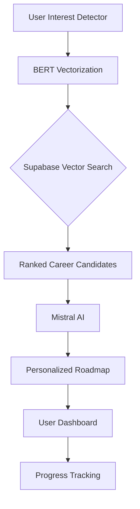

# SkillOrbit 🚀

**AI-Powered Career Intelligence & Learning Ecosystem for Healthcare Technology**

SkillOrbit is a comprehensive, AI-driven career guidance platform that leverages a hybrid AI architecture to help users discover personalized career paths, identify skill gaps, and navigate their professional journey through intelligent recommendations and structured learning roadmaps.

---

## 🎯 Project Overview & Features

In today's rapidly evolving job market, identifying the right career path is challenging. SkillOrbit addresses this by analyzing user intent beyond simple keywords, providing a data-driven "GPS" for professional growth.

### ✨ Key Features
*   **🧠 Intelligent Interest Detector**: A sophisticated 7-factor assessment analyzing cognitive styles, technical depth, work environment, and impact motivation.
*   **🎯 Semantic Career Matching**: Harnesses BERT embeddings to discover ideal roles based on the "meaning" of your background, not just keyword matches.
*   **📚 Dynamic AI Roadmaps**: Generates on-demand learning paths with modular milestones, sub-topics, and estimated durations using Mistral AI.
*   **🔬 Hyper-Sensitive Skill Gap Analysis**: Uses micro-contextual chunking to identify exactly which skills you possess and which ones are target gaps.
*   **🎓 Integrated Course Recommendations**: Automatically matches learning modules with specialized Coursera courses using vector search (Supabase pgvector).
*   **✨ Immersive 3D Experience**: Cinematic hero section powered by **Spline**, creating a futuristic and engaging user entry point.
*   **📊 Interactive Dashboard**: Manage up to 3 active roadmaps simultaneously with real-time progress tracking and persistent state.

---

## 🧠 AI Intelligence: The Hybrid Approach

SkillOrbit uses a specialized two-tier AI system to balance logical reasoning with precise semantic understanding.

### **1. BERT & Hugging Face (The "Librarian")**
*   **Model**: `Xenova/all-MiniLM-L6-v2` (Quantized q8)
*   **Library**: **Hugging Face Transformers.js**
*   **Execution**: **On-Demand Local Inference** via `@huggingface/transformers`.
*   **Purpose**: Vectorization and Semantic Search.
*   **How it works**: It converts user profiles and course descriptions into 384-dimensional vectors. Unlike keyword search, BERT understands that "Distributed Systems" is semantically related to "Scalability," even if the words don't match.
*   **Difference with Mistral**: BERT doesn't "think" or "chat"; it maps text into a high-dimensional mathematical space for lightning-fast similarity comparisons in Supabase.

### **2. Mistral AI (The "Architect")**
*   **Model**: `open-mistral-7b`
*   **Execution**: Cloud API.
*   **Purpose**: Complex Reasoning and Content Generation.
*   **How it works**: It takes the "context" (user answers + top semantic matches) and reasons through them to build a logical 5-7 module roadmap. It handles the "Why" (reasoning) and the "How" (curriculum structure).

---

## 🛠️ Tech Stack

### **Frontend & UI**
*   **Next.js 15**: App Router architecture for optimized performance and SEO.
*   **TypeScript**: Full-stack type safety.
*   **Tailwind CSS**: Modern, utility-first styling with a premium "Glassmorphism" aesthetic.
*   **Framer Motion**: Smooth, cinematic animations and transitions.
*   **Lucide React**: High-quality vector iconography.

### **Backend & Database**
*   **MongoDB (Mongoose)**: Primary store for user accounts, dashboard state, and progress.
*   **Supabase (pgvector)**: High-performance vector database for semantic course matching.
*   **JOSE / bcryptjs**: Secure JWT-based authentication and password hashing.

### **AI & ML**
*   **Mistral AI API**: Large Language Model for logic and generation.
*   **Hugging Face Transformers**: Infrastructure for running BERT models directly in the Node.js runtime (no Python required).
*   **Spline**: 3D design and interaction for the immersive hero experience.

---

## 🚀 Getting Started

### **Prerequisites**
*   Node.js 20.x or higher
*   MongoDB Atlas account
*   Mistral AI API Key
*   Supabase Project

### **Installation (Copy-Paste)**
```bash
# 1. Clone the repository
git clone https://github.com/CodexKnight-ai/SkillOrbit.git
cd skill-orbit

# 2. Install dependencies
npm install

# 3. Setup environment variables
cp .env.example .env
# Edit .env with your credentials (see below)

# 4. Start development server
npm run dev
```

---

## 🔐 Environment Variables

Create a `.env` file with following keys:

```env
# Database
MONGODB_URI=mongodb+srv://<user>:<password>@cluster0.mongodb.net/skillorbit
NEXT_PUBLIC_SUPABASE_URL=https://your-project.supabase.co
NEXT_PUBLIC_SUPABASE_ANON_KEY=your_anon_key
SUPABASE_SERVICE_ROLE_KEY=your_service_role_key

# AI Configuration
MISTRAL_API_KEY=your_mistral_key
MISTRAL_MODEL=open-mistral-7b

# Authentication
JWT_SECRET=your_32_character_random_secret
```

---

## 📁 System Architecture



---
*Developed for the HiveMind Hackathon - Empowering the next generation of healthcare technologists.*
