# SkillOrbit 

**AI-Powered Career Intelligence & Learning Ecosystem for Healthcare Technology**

SkillOrbit is a comprehensive, AI-driven career guidance platform that leverages a hybrid AI architecture to help users discover personalized career paths, identify skill gaps, and navigate their professional journey through intelligent recommendations and structured learning roadmaps.
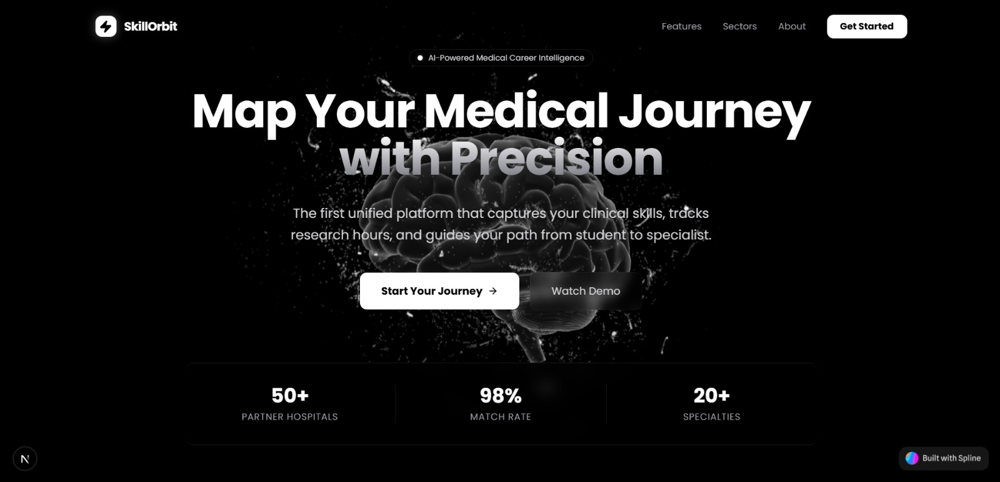

---

##  Project Overview & Features

In today's rapidly evolving job market, identifying the right career path is challenging. SkillOrbit addresses this by analyzing user intent beyond simple keywords, providing a data-driven "GPS" for professional growth.

###  Key Features
*   ** Intelligent Interest Detector**: A sophisticated 7-factor assessment analyzing cognitive styles, technical depth, work environment, and impact motivation.
*   ** Semantic Career Matching**: Harnesses BERT embeddings to discover ideal roles based on the "meaning" of your background, not just keyword matches.
*   ** Dynamic AI Roadmaps**: Generates on-demand learning paths with modular milestones, sub-topics, and estimated durations using Mistral AI.
*   ** Hyper-Sensitive Skill Gap Analysis**: Uses micro-contextual chunking to identify exactly which skills you possess and which ones are target gaps.
*   ** Integrated Course Recommendations**: Automatically matches learning modules with specialized Coursera courses using vector search (Supabase pgvector).
*   ** Immersive 3D Experience**: Cinematic hero section powered by **Spline**, creating a futuristic and engaging user entry point.
*   ** Interactive Dashboard**: Manage up to 3 active roadmaps simultaneously with real-time progress tracking and persistent state.

---
# User Form
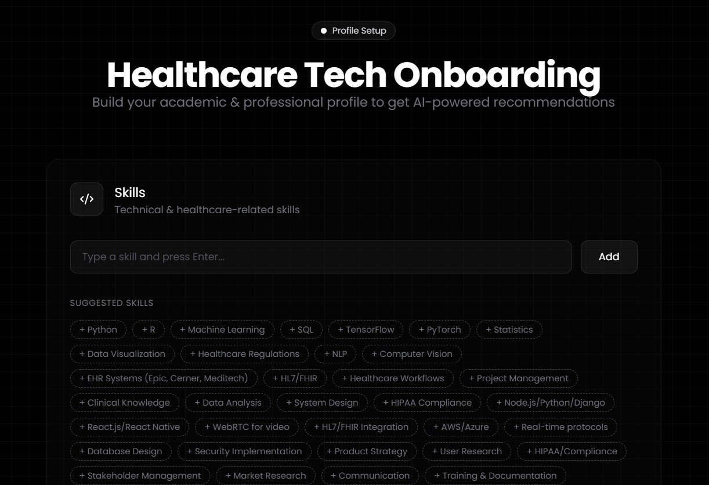
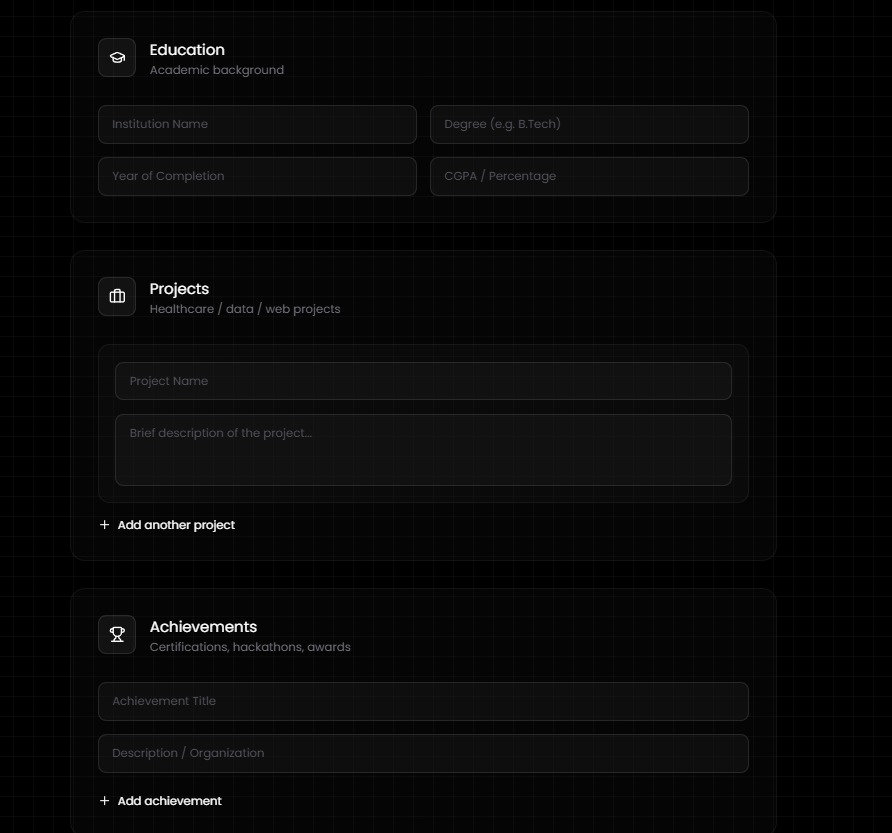

# Top 3 Career Recommendations
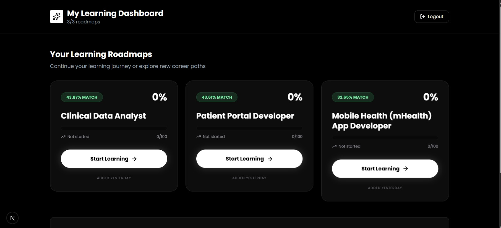

##  AI Intelligence: The Hybrid Approach

SkillOrbit uses a specialized two-tier AI system to balance logical reasoning with precise semantic understanding.

### **1. BERT & Hugging Face (The "Librarian")**
*   **Model**: `Xenova/all-MiniLM-L6-v2` (Quantized q8)
*   **Library**: **Hugging Face Transformers.js**
*   **Execution**: **On-Demand Local Inference** via `@huggingface/transformers`.
*   **Purpose**: Vectorization and Semantic Search.
*   **How it works**: It converts user profiles and course descriptions into 384-dimensional vectors. Unlike keyword search, BERT understands that "Distributed Systems" is semantically related to "Scalability," even if the words don't match.
*   **Difference with Mistral**: BERT doesn't "think" or "chat"; it maps text into a high-dimensional mathematical space for lightning-fast similarity comparisons in Supabase.

### **2. Mistral AI (The "Architect")**
*   **Model**: `open-mistral-7b`
*   **Execution**: Cloud API.
*   **Purpose**: Complex Reasoning and Content Generation.
*   **How it works**: It takes the "context" (user answers + top semantic matches) and reasons through them to build a logical 5-7 module roadmap. It handles the "Why" (reasoning) and the "How" (curriculum structure).

---

## 🔬 The Skill Gap Algorithm

The core engine of SkillOrbit is its **Hyper-Sensitive Skill Recognition** algorithm. Unlike traditional platforms that use basic keyword matching, SkillOrbit treats your profile as a set of multidimensional semantic features.

### **1. Micro-Context Chunking**
To ensure no skill is missed, the algorithm breaks down the user's profile into granular "Micro-Contexts":
*   **Skills & Education**: Direct mapping of known skills and academic background.
*   **Project Semantic Extraction**: Project descriptions are split into individual sentences. This ensures a mention of *"leveraged Git for version control"* in a 300-word paragraph is isolated as a specific evidence point.

### **2. Tiered Recognition Engine**
Each job requirement is analyzed against the user's "Knowledge Base" using a two-tier approach:
*   **Tier 1: Literal Match**: Fast-path substring comparison for tool names (e.g., "React" matching "React.js").
*   **Tier 2: Semantic Similarity (BERT)**: 
    *   The requirement (e.g., *"Cloud Infrastructure"*) and the user's context (e.g., *"Deployed to AWS"*) are vectorized using **all-MiniLM-L6-v2**.
    *   **Cosine Similarity** is calculated. A score **> 0.60** counts as a recognized skill, even if the terminology differs.

### **3. Priority Gap Analysis**
Unmatched skills are categorized into a hierarchical gap report:
*   **Foundational Gaps**: Missing core skills required to start the career.
*   **Intermediate/Advanced Gaps**: Skills needed for professional growth.
*   **Result**: This data is passed to **Mistral AI** to ensure the generated Roadmap prioritizes foundational gaps first.
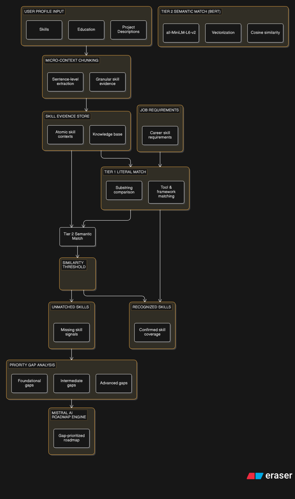
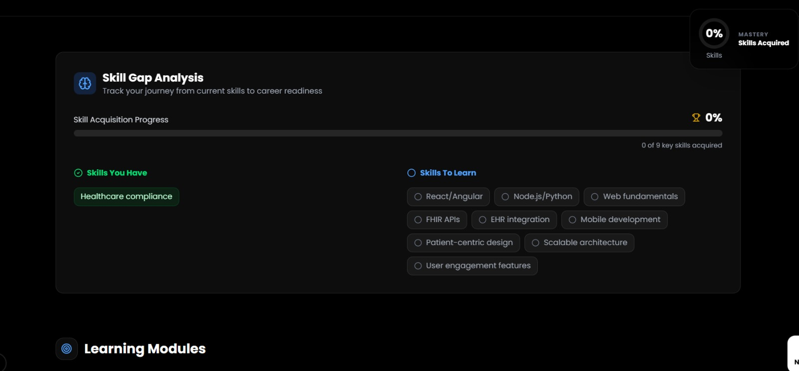
---

## 🎓 Semantic Course Recommendation Engine

SkillOrbit doesn't just tell you what's missing; it provides the bridge to acquire those skills through a high-performance vector search system.

### **1. The Dataset: Specialized Coursera Corpus**
*   **Source**: A curated and scraped dataset of specialized courses from **Coursera**.
*   **Attributes**: Includes course titles, providers (e.g., Google, IBM, Stanford), and detailed descriptions.
*   **Vectorization**: The entire corpus is pre-processed and stored as **BERT embeddings** within the database.

### **2. Vector Database (Supabase + pgvector)**
*   **Technology**: **pgvector** extension on **Supabase**.
*   **The Advantage**: Instead of standard SQL `LIKE` queries which fail with context, we use **Neighbor Search (Vector Similarity)**.
*   **Indexing**: Uses an **HNSW (Hierarchical Navigable Small World)** index for sub-millisecond similarity search across the entire course library.

### **3. Dynamic Matching Logic**
When a learning module is generated:
1.  **Context Synthesis**: A weighted search query is built using the `Module Title` + `Missing Skills`.
2.  **On-Demand Embedding**: The BERT model (`all-MiniLM-L6-v2`) creates a 384D vector representing the *intent* of the module.
3.  **Cross-Reference**: The algorithm performs an RPC call (`match_coursera_courses`) in Supabase to calculate the distance between the module's intent and the course library.
4.  **Curated Suggested**: Only courses with a similarity score **> 0.35** are recommended, ensuring high relevance to the specific career gap.
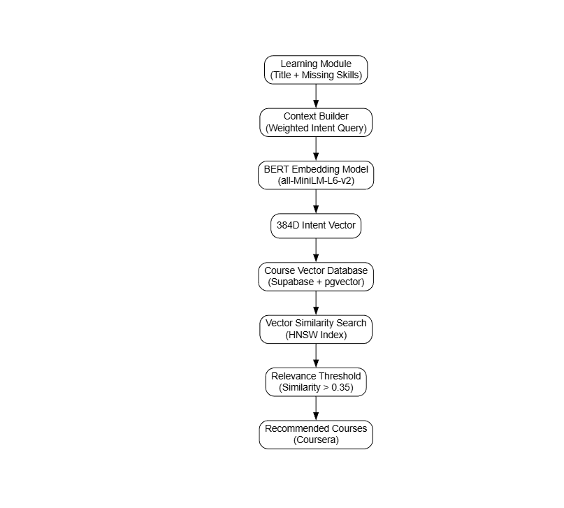
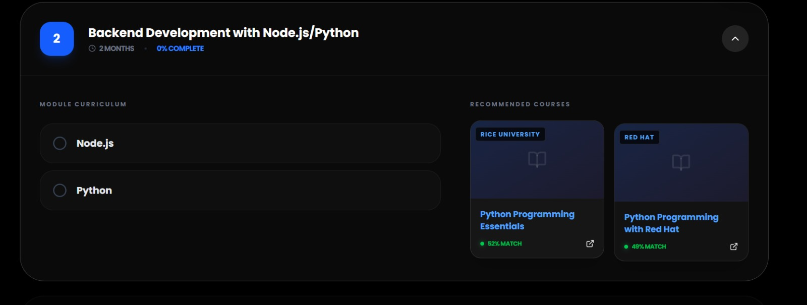
---

#Extra Features
## Live notes making with each course module (used production grade DEBOUNCING METHOD)
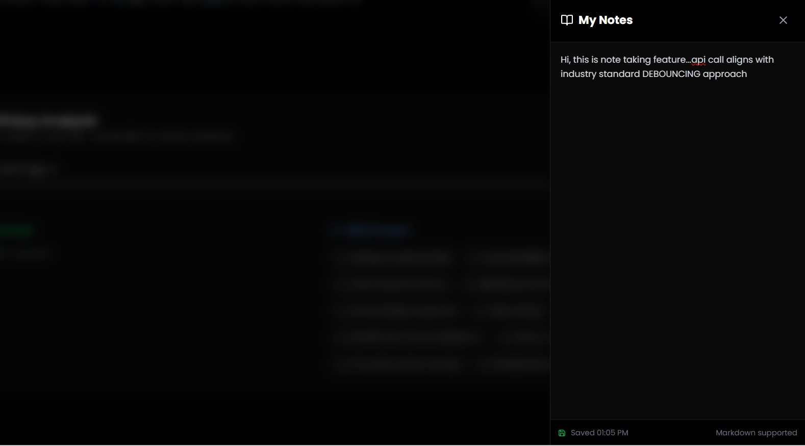

## QnA for personalized planning
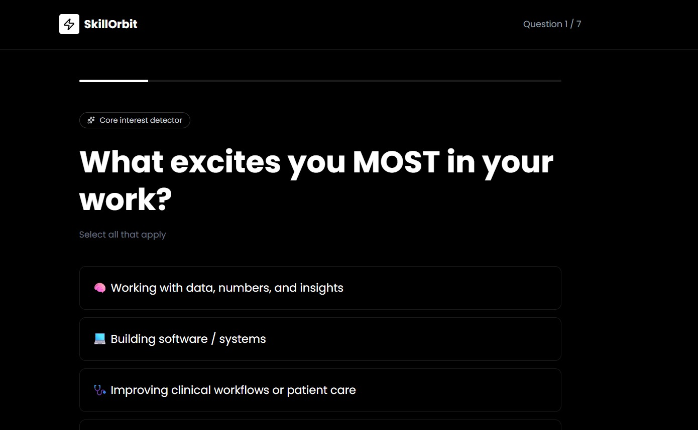
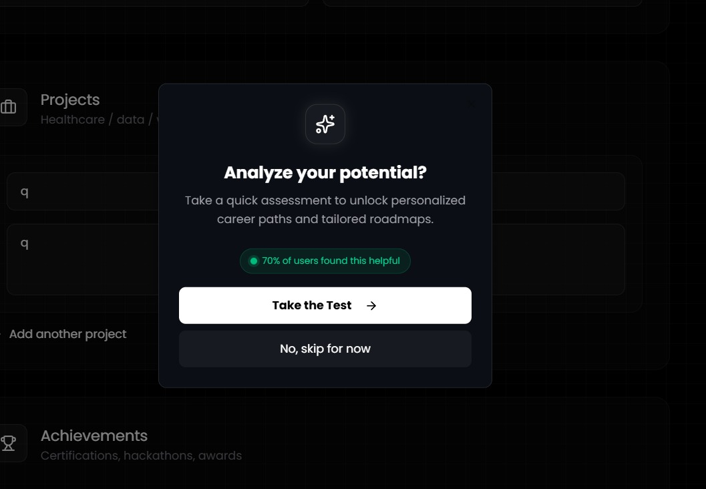

## 3-d Hero section
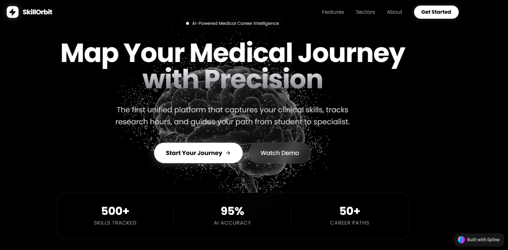
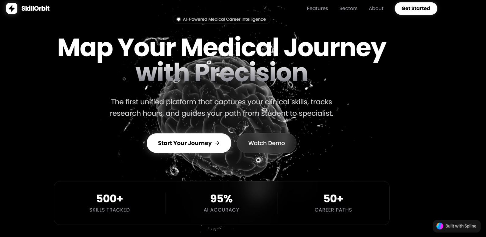
## 🛠️ Tech Stack

### **Frontend & UI**
*   **Next.js 15**: App Router architecture for optimized performance and SEO.
*   **TypeScript**: Full-stack type safety.
*   **Tailwind CSS**: Modern, utility-first styling with a premium "Glassmorphism" aesthetic.
*   **Framer Motion**: Smooth, cinematic animations and transitions.
*   **Lucide React**: High-quality vector iconography.

### **Backend & Database**
*   **MongoDB (Mongoose)**: Primary store for user accounts, dashboard state, and progress.
*   **Supabase (pgvector)**: High-performance vector database for semantic course matching.
*   **JOSE / bcryptjs**: Secure JWT-based authentication and password hashing.

### **AI & ML**
*   **Mistral AI API**: Large Language Model for logic and generation.
*   **Hugging Face Transformers**: Infrastructure for running BERT models directly in the Node.js runtime (no Python required).
*   **Spline**: 3D design and interaction for the immersive hero experience.

---

## 🚀 Getting Started

### **Prerequisites**
*   Node.js 20.x or higher
*   MongoDB Atlas account
*   Mistral AI API Key
*   Supabase Project

### **Installation (Copy-Paste)**
```bash
# 1. Clone the repository
git clone https://github.com/CodexKnight-ai/SkillOrbit.git
cd skill-orbit

# 2. Install dependencies
npm install

# 3. Setup environment variables
cp .env.example .env
# Edit .env with your credentials (see below)

# 4. Start development server
npm run dev
```

---

## 🔐 Environment Variables

Create a `.env` file with following keys:

```env
# Database
MONGODB_URI=mongodb+srv://<user>:<password>@cluster0.mongodb.net/skillorbit
NEXT_PUBLIC_SUPABASE_URL=https://your-project.supabase.co
NEXT_PUBLIC_SUPABASE_ANON_KEY=your_anon_key
SUPABASE_SERVICE_ROLE_KEY=your_service_role_key

# AI Configuration
MISTRAL_API_KEY=your_mistral_key
MISTRAL_MODEL=open-mistral-7b

# Authentication
JWT_SECRET=your_32_character_random_secret
```

---

## 📁 System Architecture

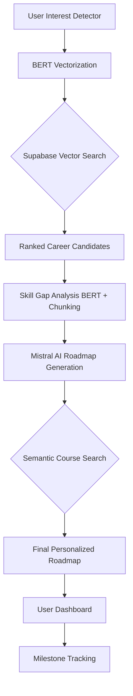
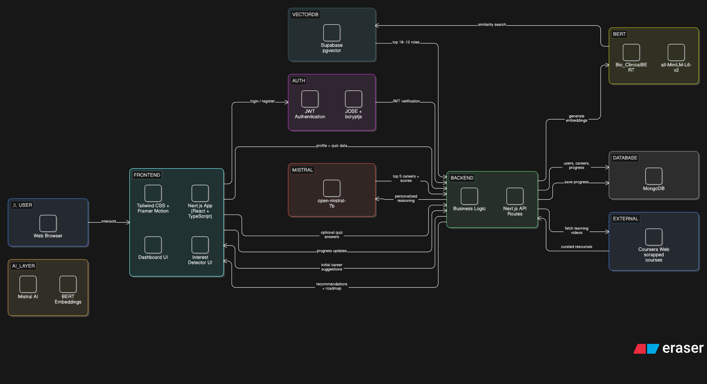

---
*Developed for the Ingenium 2026 Hackathon - Empowering the next generation of healthcare technologists.*
